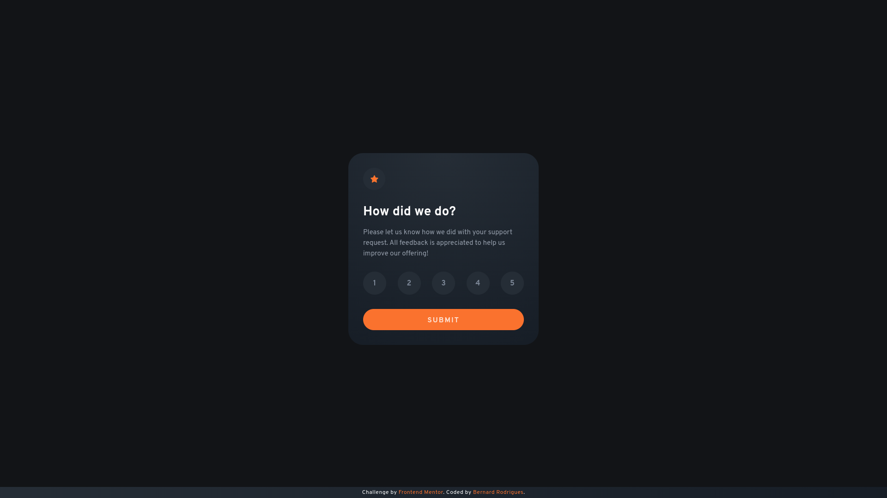
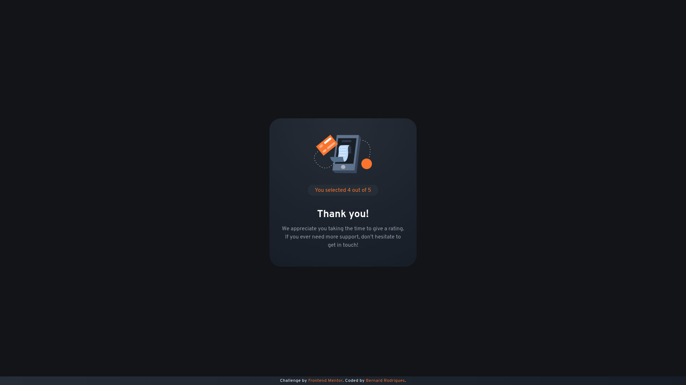
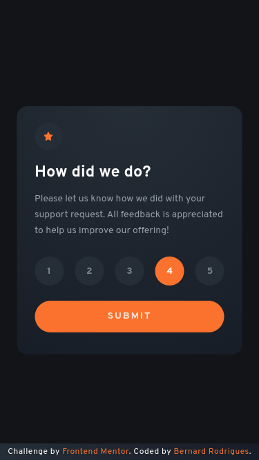

# Frontend Mentor - Interactive rating component solution

This is a solution to the [Interactive rating component challenge on Frontend Mentor](https://www.frontendmentor.io/challenges/interactive-rating-component-koxpeBUmI). Frontend Mentor challenges help you improve your coding skills by building realistic projects. 

## Table of contents

- [Overview](#overview)
  - [The challenge](#the-challenge)
  - [Screenshot](#screenshot)
  - [Links](#links)
- [My process](#my-process)
  - [Built with](#built-with)
  - [What I learned](#what-i-learned)
- [Author](#author)
- [Acknowledgments](#acknowledgments)

## Overview

### The challenge

Users should be able to:

- View the optimal layout for the app depending on their device's screen size
- See hover states for all interactive elements on the page
- Select and submit a number rating
- See the "Thank you" card state after submitting a rating

### Screenshot

### Links

- [Solution URL](https://www.frontendmentor.io/solutions/interactive-rating-component-sass-and-jquery-OSoUqXl8-B)
- [Live Site URL](https://frontendmentor-interactive-rating-component-five.vercel.app/)

## My process

### Built with

- [SASS/SCSS](https://sass-lang.com/) for styles
- [jQuery](https://jquery.com/)
- Mobile-first workflow

## Author

- [Github](https://github.com/bernard-rodrigues/)
- Frontend Mentor: [@bernard-rodrigues](https://www.frontendmentor.io/profile/bernard-rodrigues/)
- [LinkedIn](https://linkedin.com/in/bernard-rodrigues/)

## Acknowledgments

I'd like to thank my friend [Cadu Vieira](https://github.com/caduovieira/) who motivated me to participate in this challenge.
